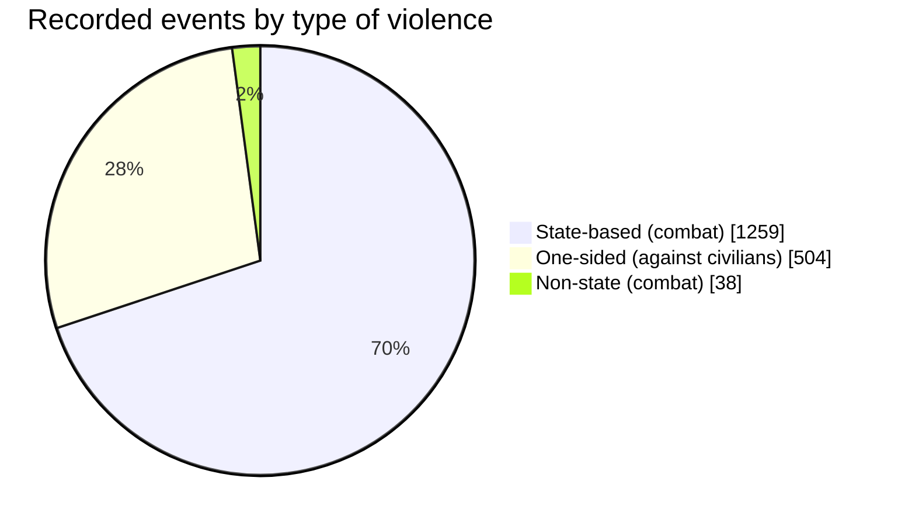
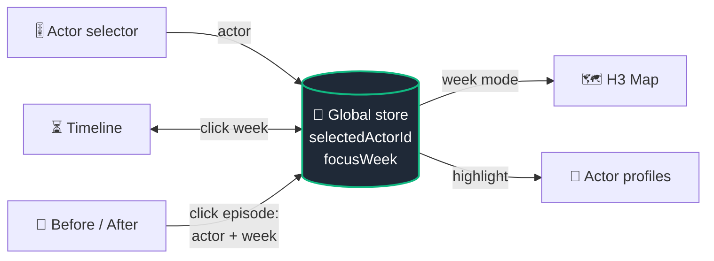
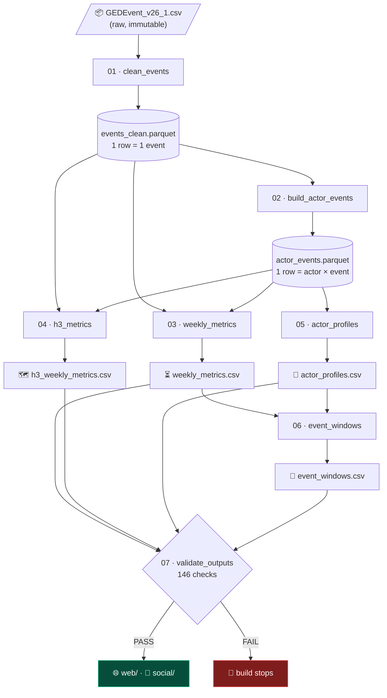
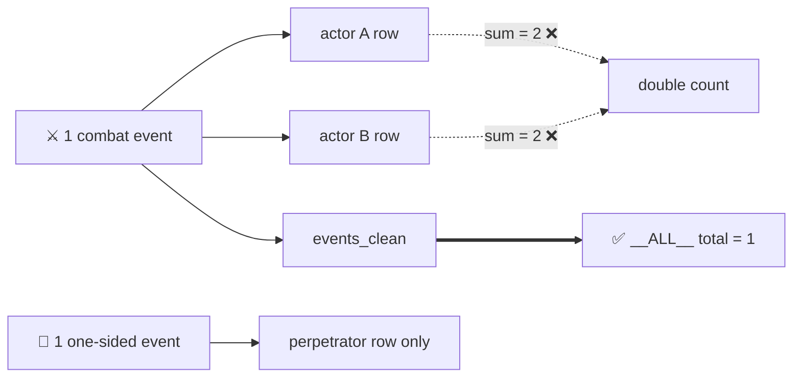
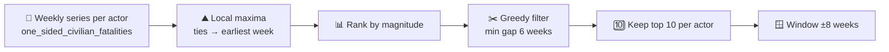

<div align="center">

# 🕊️ War Civilian Violence

### *When and where do armed actors turn from the battlefield to civilians?*

Patterns of **one-sided violence against civilians** in the **Sudan conflict**, built on the UCDP Georeferenced Event Dataset.


<!-- 🖼️ HERO IMAGE: wide banner (~1600x600).
     Suggested: the weekly timeline area chart (orange / light blue / red) from Web 1.
     Save as: docs/assets/readme/hero.png -->
> 🖼️ **[ HERO BANNER GOES HERE ]** `docs/assets/readme/hero.png`

**[📊 Web app](#-quickstart)** · **[🧪 Pipeline](#%EF%B8%8F-the-pipeline)** · **[📱 Social exports](#-social-exports)** · **[📚 Docs](#-documentation)**

</div>

---

## 🔎 The question

> When and where do armed actors shift from direct combat toward deliberate violence against civilians, and what temporal, spatial, and actor-specific patterns accompany this transition?

Analysis window: **2023-04-15 → 2025-12-31**, Sudan only.

---

## 📈 At a glance

| 🗂️ Events | 🎯 One-sided events | ⚰️ Civilian fatalities recorded | 🧑‍🤝‍🧑 Actors profiled | ⏱️ Episodes detected | ✅ Validation checks |
|:---:|:---:|:---:|:---:|:---:|:---:|
| **1,801** | **504** | **73,836** | **22** | **27** | **146 / 146** |



---

## 🧭 Four views, one story

Each view answers one question and reads **one pre-aggregated CSV**. No analysis runs in the browser.

| | View | Question | Tech |
|:---:|---|---|---|
| ⏳ | **01 · Timeline** | *When* does one-sided violence become prominent? | D3 |
| 🗺️ | **02 · H3 Map** | *Where* does it concentrate compared to combat? | MapLibre + deck.gl |
| 🧬 | **03 · Actor Fingerprints** | *Who* behaves differently? | D3 parallel coordinates |
| 🔬 | **04 · Before / After** | What does the *weekly rhythm* around a peak look like? | D3 |

<table>
<tr>
<td align="center">

<!-- 🖼️ Save as: docs/assets/readme/view-01-timeline.png (~800x450) -->
🖼️ **[ TIMELINE ]**<br>`view-01-timeline.png`

</td>
<td align="center">

<!-- 🖼️ Save as: docs/assets/readme/view-02-map.png (~800x450) -->
🖼️ **[ H3 MAP ]**<br>`view-02-map.png`

</td>
</tr>
<tr>
<td align="center">

<!-- 🖼️ Save as: docs/assets/readme/view-03-actors.png (~800x450) -->
🖼️ **[ ACTOR FINGERPRINTS ]**<br>`view-03-actors.png`

</td>
<td align="center">

<!-- 🖼️ Save as: docs/assets/readme/view-04-event-windows.png (~800x450) -->
🖼️ **[ BEFORE / AFTER ]**<br>`view-04-event-windows.png`

</td>
</tr>
</table>

<!-- 🖼️ OPTIONAL GIF: 10-15s screen capture of picking an actor and watching all four views react.
     Save as: docs/assets/readme/demo.gif -->
> 🎞️ **[ OPTIONAL DEMO GIF ]** `docs/assets/readme/demo.gif`: pick an actor, watch every view follow.

### 🔗 How the views talk to each other

Only what changes *another* view is global. Hover, zoom and toggles stay local.



---

## ⚙️ The pipeline

Python does all the heavy lifting once. The browser only does `load → filter → render → interact`.



`build_all.py` runs the stages in strict order and **stops at the first failure**. It never leaves stale downstream files.

### 🧮 The `__ALL__` rule (no double counting)

A combat event has two armed sides, so it becomes **two** actor rows. Summing actor rows would count it twice, so conflict-wide totals are always computed straight from `events_clean`.



### 🩸 Fatality fields (do not conflate)

| Field | Definition |
|---|---|
| `combatant_fatalities` | `deaths_a + deaths_b`, combat events only (type 1, 2) |
| `civilian_fatalities` | `deaths_civilians`, any violence type |
| `one_sided_civilian_fatalities` | `deaths_civilians` only when type is 3, the peak-detection metric |

### 🔬 How episodes are found (deterministic, not hand-picked)



Weeks inside the analysis period with no events are a real `0`. Weeks outside it are `NA` (`is_observed_week = False`). These are never mixed.

### 🧱 Design choices

| 🎛️ Parameter | Value | Where |
|---|---|---|
| Spatial grid | H3 resolution **5** (~253 km² per cell) | `config/config.yaml` |
| Time grain | Weekly, Monday start | `config/config.yaml` |
| Min events for default actor view | **5** | `config/config.yaml` |
| Episode window | **8 weeks** before and after | `config/config.yaml` |

Every tunable lives in the config file, never in a script.

---

## 🚀 Quickstart

### 1️⃣ Get the data

Download **UCDP GED Global v26.1** and place it (unmodified) at:

```text
data/raw/GEDEvent_v26_1.csv
```

### 2️⃣ Run the Python pipeline

```bash
pyenv activate test          # Python 3.12 env
poetry install
poetry run python scripts/build_all.py
```

Run one stage alone: `poetry run python scripts/01_clean_events.py`

### 3️⃣ Launch the web app

```bash
cd web
npm install
npm run dev        # copies data/derived/* into web/.generated, then starts Vite
npm test           # view math + integration tests
```

### 4️⃣ Browse the docs

```bash
poetry run mkdocs serve
```

---

## 📱 Social exports

Two Instagram and two X posts, rendered as static images from the **same** derived CSVs, so numbers match the web app.

| Post | Format | Message |
|---|---|---|
| 📸 Instagram 01 · Temporal | 1080 × 1350 | When does one-sided violence become prominent? |
| 📸 Instagram 02 · Actors | 1080 × 1350 | Who differs, and how? |
| 🐦 X 01 · Before / After | 1600 × 900 | The rhythm around a peak |
| 🐦 X 02 · Geography | 1600 × 900 | Combat and civilian targeting do not occupy space the same way |

<table>
<tr>
<td align="center">

<!-- 🖼️ Save as: docs/assets/readme/social-instagram-01.png -->
🖼️ **[ INSTAGRAM 01 ]**<br>`social-instagram-01.png`

</td>
<td align="center">

<!-- 🖼️ Save as: docs/assets/readme/social-x-02.png -->
🖼️ **[ X 02 ]**<br>`social-x-02.png`

</td>
</tr>
</table>

```bash
cd social
npm install
npm run export     # PNGs land in social/output/
```

---

## 🗂️ Repository map

```text
war-civilian-violence/
├── 📜 PROJECT_SPEC.md        design narrative and methodological cautions
├── ⚙️ config/                 config.yaml, the single source of tunables
├── 🐍 scripts/               01 → 07 pipeline stages + build_all.py
├── 📦 data/
│   ├── DATA_FILES.md         schema authority: exact field names
│   ├── raw/                  GED download (git-ignored)
│   ├── processed/            events_clean, actor_events (parquet)
│   ├── derived/              the four CSVs the frontend reads
│   └── validation/           report + failures
├── 🌐 web/                   Vite + TypeScript + D3 + MapLibre + deck.gl
│   └── src/viz/              timeline · map · actors · event-windows
├── 📱 social/                Instagram + X post renderers (Playwright)
└── 📚 docs/                  mkdocs site, phase reports, script reference
```

---

## ⚠️ Read this before drawing conclusions

- 🧭 **Descriptive, not causal.** The project shows *temporal, spatial and actor-specific association*. It does **not** claim that battlefield losses or military pressure *cause* violence against civilians.
- 📉 **Recorded events only.** UCDP counts what its sources report. Access, media coverage and verification vary over time and place, so a change in the chart can be a change in reporting.
- 🎯 **Each event is dated by its UCDP start date** (`date_start`) when aggregated by week.
- 📍 **Events with bad coordinates are kept** in timeline and actor views, flagged `spatial_eligible = False`, and left out of the map only.

---

## 📚 Documentation

| Read | For |
|---|---|
| [`PROJECT_SPEC.md`](PROJECT_SPEC.md) | Why the architecture looks like this |
| [`data/DATA_FILES.md`](data/DATA_FILES.md) | Exact schemas, producers and consumers |
| [`scripts/SCRIPTS.md`](scripts/SCRIPTS.md) | Per-script contract |
| [`web/WEB.md`](web/WEB.md) · [`web/VIZ.md`](web/VIZ.md) | Frontend plan and the four views |
| [`docs/`](docs/index.md) | Full mkdocs site: phases 1-4 and script reference |


---

## 🙏 Data and license

- **Data:** Davies, S., Pettersson, T., & Öberg, M. *UCDP Georeferenced Event Dataset (GED) Global v26.1*, Uppsala Conflict Data Program. Codebook: `data/raw/ged261.pdf`. Raw data is **not** redistributed here.
- **Code:** [GNU GPL v3](LICENSE).

<div align="center">

*Behind every row is a person. 🕊️*

</div>
